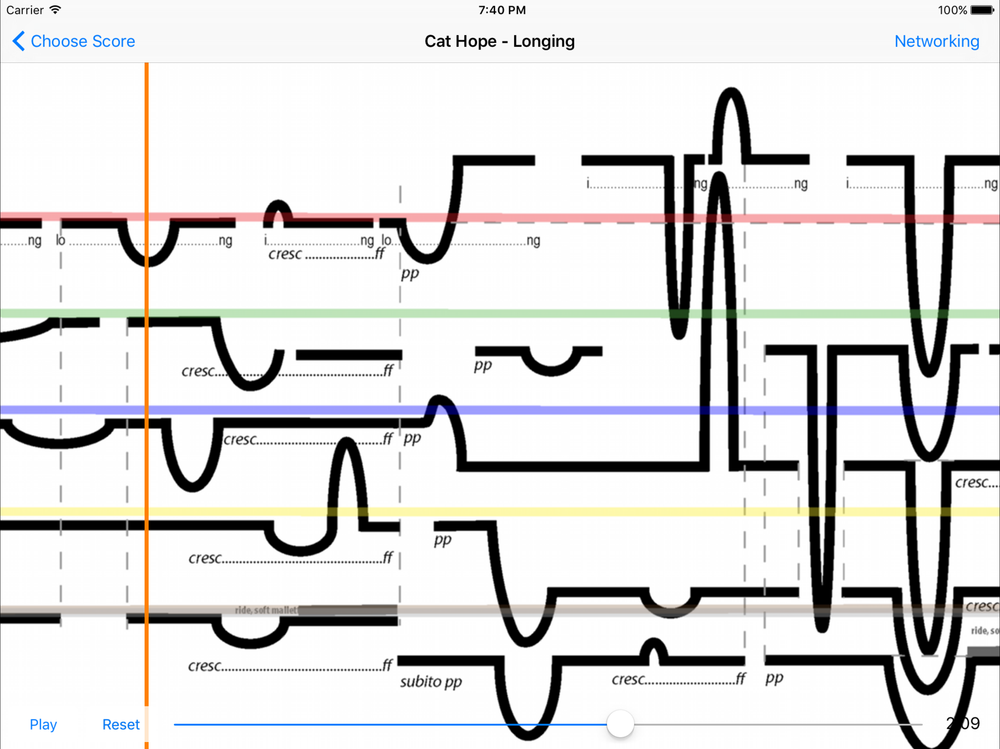

# Decibel ScorePlayer
The Decibel ScorePlayer is an iPad app for the display of network synchronised, animated graphic notation scores, originally created for use within the [Decibel New Music Ensemble](https://decibelnewmusic.com/) in Perth, Western Australia.

It is released under the GNU GPLv3 (see LICENSE for details), but is also available from [Apple's App Store](https://apps.apple.com/au/app/decibel-scoreplayer/id622591851) under the Mozilla Public License 2.0 (see MPL). It relies on some third party libraries (SSZipArchive and CocoaAsyncSocket) which are included here for convenience. The relevant licenses and copyright information for these libraries can be found in their respective folders.

The app includes some example scores by members of the ensemble. These and other graphics resources are released under the Creative Commons Attribution-NonCommercial-NoDerivs (CC BY-NC-ND) license.

## Building
To build the app you'll need a copy of XCode. Simply load the included XCode project file and run it within one of the included iPad simulators. (To load it onto a real device you'll need an Apple developer account.)

## More Information
Some information on the inner workings of the ScorePlayer can be found [here](https://www.psi-borg.org), although this is far from a complete resource. A number of academic papers have been written about the software, and a quick search on Google Scholar should uncover these. Of particular use are those authored or co-authored by members of the Decibel New Music Ensemble. (Cat Hope, Lindsay Vickery, Aaron Wyatt, and Stuart James.)
